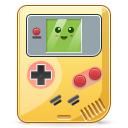

<p align="center">
  
</p>
<h1 align="center">Vee</h1>
<!-- <p align="center">
  <a href="https://appcenter.elementary.io/com.github.avojak.vee"></a>
</p> -->

## Vala Game Boy Emulator

Vee is a project for experimenting with emulation written in Vala. The primary goal is to create a Game Boy emulator, however other systems will be included along the way (including CHIP-8). Vee is designed for [elementary OS](https://elementary.io).

For work on a multi-system emulator for elementary OS, check out my other project: [Vee](https://github.com/avojak/vee).

### Background

I have wanted to create my own Game Boy emulator for a very long time. Along the way I realized that I should start out a bit more modest and implement a CHIP-8 emulator (technically interpreter) first. I plan on implementing debugging tools for each system that is emulated in the hopes of helping other people along with their own emulator journey.

## Install from Source

You can install Vee by compiling from source. Here's the list of
dependencies required:

- `granite (>= 0.6.0)`
- `debhelper (>= 10.5.1)`
- `gettext`
- `libgtk-3-dev (>= 3.10)`
- `meson`
- `valac (>= 0.28.0)`

An `install-dev-dependencies.sh` script is available to help developers get up and running.

## Building and Running

```
$ meson build --prefix=/usr
$ sudo ninja -C build install
$ com.github.avojak.vee
```

### Flatpak

To test the Flatpak build with Flatpak Builder:

```bash
$ flatpak-builder build com.github.avojak.vee.yml --user --install --force-clean
$ flatpak run --env=G_MESSAGES_DEBUG=all com.github.avojak.vee
```

### Development Build

You can also install a development build alongside a stable version by specifying the dev profile:

```
$ meson build --prefix=/usr -Dprofile=dev
$ sudo ninja -C build install
$ G_MESSAGES_DEBUG=all com.github.avojak.vee-dev
```

### Updating Translations

When new translatable strings are added, ensure that `po/POTFILES` contains a
reference to the file with the translatable string.

Update the `.pot` file which contains the translatable strings:

```
$ ninja -C build com.github.avojak.vee-pot
```

Generate translations for the languages listed in the `po/LINGUAS` files:

```
$ ninja -C build com.github.avojak.vee-update-po
```

---

## Copyright Notice

Vee is not affiliated, associated, authorized, endorsed by, or in any way officially connected with Nintendo&reg;, or any of its subsidiaries or its affiliates. Game Boy&trade; is a registered trademark of Nintendo Corporation.

All other product names mentioned herein, with or without the registered trademark symbol &reg; or trademark symbol &trade; are generally trademarks and/or registered trademarks of their respective owners.
